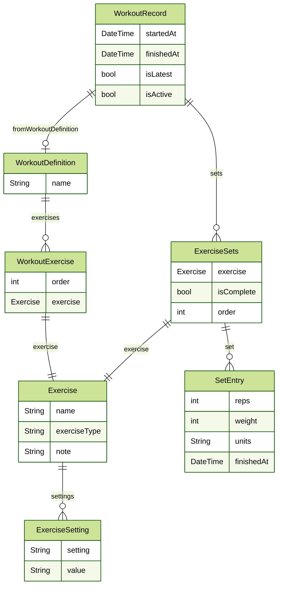
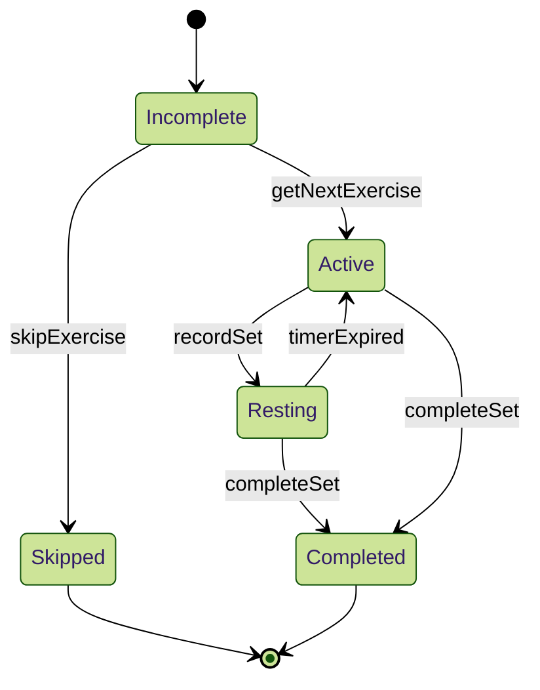

# Domain Classes

```mermaid
---
config:
  theme: forest
  er:
    layoutDirection: TB
---
erDiagram

    Exercise ||--o{ ExerciseSetting : settings
    WorkoutExercise ||--|| Exercise : exercise
    WorkoutDefinition ||--o{ WorkoutExercise : exercises
    ExerciseSets ||--|| Exercise : exercise
    ExerciseSets ||--o{ SetEntry : set
    WorkoutRecord ||--o| WorkoutDefinition : fromWorkoutDefinition
    WorkoutRecord ||--o{ ExerciseSets : sets

    ExerciseSetting {
        String setting
        String value
    }

    Exercise {
        String name
        String exerciseType
        String note
    }

    SetEntry {
        int reps
        int weight
        String units
        DateTime finishedAt
    }

    WorkoutExercise {
        int order
        Exercise exercise
    }

    WorkoutDefinition{
        String name
    }

    ExerciseSets {
        Exercise exercise
        bool isComplete
        int order
    }

    WorkoutRecord {
        DateTime startedAt
        DateTime finishedAt
        bool isLatest
        bool isActive
    }

```
# WorkoutExercise State

```mermaid
---
config:
  theme: forest
---
stateDiagram-v2
    direction TB
    [*] --> Incomplete
    Incomplete --> Active : getNextExercise
    Incomplete --> Skipped : skipExercise

    Active --> Resting : recordSet

    Resting --> Active : timerExpired

    Resting --> Completed : completeSet
    Active --> Completed : completeSet

    Skipped --> [*]
    Completed --> [*]

```