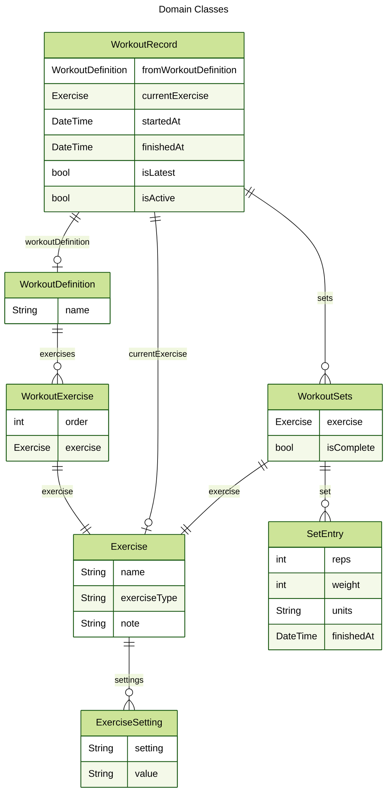

```mermaid
---
title: Domain Classes
config:
  theme: forest
  er:
    layoutDirection: TB
---
erDiagram

    Exercise ||--o{ ExerciseSetting : settings
    WorkoutExercise ||--|| Exercise : exercise
    WorkoutDefinition ||--o{ WorkoutExercise : exercises
    WorkoutSets ||--|| Exercise : exercise
    WorkoutSets ||--o{ SetEntry : set
    WorkoutRecord ||--o| WorkoutDefinition : workoutDefinition
    WorkoutRecord ||--o| Exercise : currentExercise
    WorkoutRecord ||--o{ WorkoutSets : sets

    ExerciseSetting {
        String setting
        String value
    }

    Exercise {
        String name
        String exerciseType
        String note
    }

    SetEntry {
        int reps
        int weight
        String units
        DateTime finishedAt
    }

    WorkoutExercise {
        int order
        Exercise exercise
    }

    WorkoutDefinition{
        String name
    }

    WorkoutSets {
        Exercise exercise
        bool isComplete
    }

    WorkoutRecord {
        WorkoutDefinition fromWorkoutDefinition
        Exercise currentExercise
        DateTime startedAt
        DateTime finishedAt
        bool isLatest
        bool isActive
    }

```