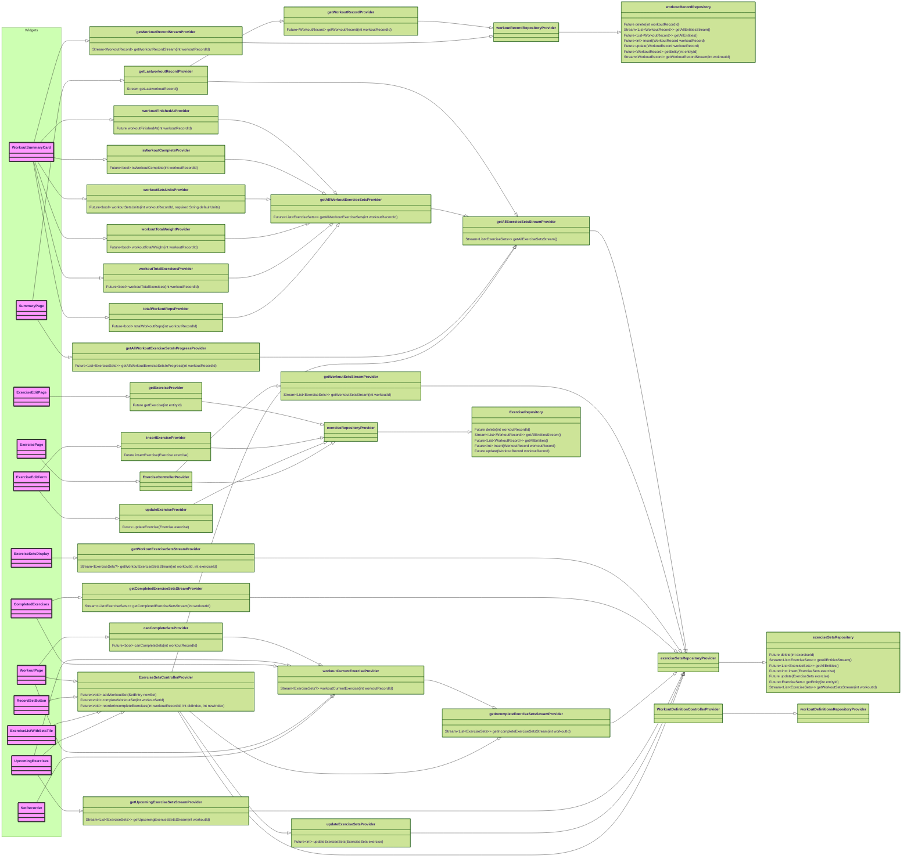

# Provider Classes

```mermaid
---
config:
  theme: forest
---
classDiagram
direction RL
    class workoutRecordRepositoryProvider

    class workoutRecordRepository {
        Future delete(int workoutRecordId)
        Stream~List~WorkoutRecord~~ getAllEntitiesStream()
        Future~List~WorkoutRecord~~ getAllEntities()
        Future~int~ insert(WorkoutRecord workoutRecord)
        Future update(WorkoutRecord workoutRecord)
        Future~WorkoutRecord~ getEntity(int entityId)
        Stream~WorkoutRecord~ getWorkoutRecordStream(int wokroutId)
    }

    class getWorkoutRecordProvider {
        Future~WorkoutRecord~ getWorkoutRecord(int workoutRecordId)
    }

    class getWorkoutRecordStreamProvider {
        Stream~WorkoutRecord~ getWorkoutRecordStream(int workoutRecordId)
    }

    class workoutFinishedAtProvider {
        Future<DateTime> workoutFinishedAt(int workoutRecordId)
    }

    class isWorkoutCompleteProvider {
        Future~bool~ isWorkoutComplete(int workoutRecordId)
    }

    class workoutSetsUnitsProvider {
        Future~bool~ workoutSetsUnits(int workoutRecordId, required String defaultUnits)
    }

    class workoutTotalWeightProvider {
        Future~bool~ workoutTotalWeight(int workoutRecordId)
    }

    class workoutTotalExercisesProvider {
        Future~bool~ workoutTotalExercises(int workoutRecordId)
    }

    class totalWorkoutRepsProvider {
        Future~bool~ totalWorkoutReps(int workoutRecordId)
    }

    class getLastworkoutRecordProvider {
        Stream<WorkoutRecord> getLastworkoutRecord()
    }

    workoutRecordRepository <|-- workoutRecordRepositoryProvider
    workoutRecordRepositoryProvider <|-- getWorkoutRecordProvider
    workoutRecordRepositoryProvider <|-- getWorkoutRecordStreamProvider
    getAllWorkoutExerciseSetsProvider <|-- workoutFinishedAtProvider
    getAllWorkoutExerciseSetsProvider <|-- isWorkoutCompleteProvider
    getAllWorkoutExerciseSetsProvider <|-- workoutSetsUnitsProvider
    getAllWorkoutExerciseSetsProvider <|-- workoutTotalWeightProvider
    getAllWorkoutExerciseSetsProvider <|-- workoutTotalExercisesProvider
    getAllWorkoutExerciseSetsProvider <|-- totalWorkoutRepsProvider
    getAllExerciseSetsStreamProvider <|-- getLastworkoutRecordProvider
    getWorkoutRecordProvider <|-- getLastworkoutRecordProvider

    class exerciseSetsRepositoryProvider { }
    class exerciseSetsRepository {
        Future delete(int exerciseId)
        Stream~List~ExerciseSets~~ getAllEntitiesStream()
        Future~List~ExerciseSets~~ getAllEntities()
        Future~int~ insert(ExerciseSets exercise)
        Future update(ExerciseSets exercise)
        Future~ExerciseSets~ getEntity(int entityId)
        Stream~List~ExerciseSets~~ getWorkoutSetsStream(int workoutId)
    }

    class getAllWorkoutExerciseSetsProvider {
        Future~List~ExerciseSets~~ getAllWorkoutExerciseSets(int workoutRecordId)
    }

    class getAllWorkoutExerciseSetsInProgressProvider {
        Future~List~ExerciseSets~~ getAllWorkoutExerciseSetsInProgress(int workoutRecordId)
    }

    class getAllExerciseSetsStreamProvider {
        Stream~List~ExerciseSets~~ getAllExerciseSetsStream()
    }

    class workoutCurrentExerciseProvider {
        Stream~ExerciseSets?~ workoutCurrentExercise(int workoutRecordId)
    }

    class canCompleteSetsProvider {
        Future~bool~ canCompleteSets(int workoutRecordId)
    }

    class getWorkoutExerciseSetsStreamProvider {
        Stream~ExerciseSets?~ getWorkoutExerciseSetsStream(int workoutId, int exerciseId)
    }


    class getWorkoutSetsStreamProvider {
        Stream~List~ExerciseSets~~ getWorkoutSetsStream(int workoutId)
    }

    class getCompletedExerciseSetsStreamProvider {
        Stream~List~ExerciseSets~~ getCompletedExerciseSetsStream(int workoutId)
    }

    class getIncompleteExerciseSetsStreamProvider {
        Stream~List~ExerciseSets~~ getIncompleteExerciseSetsStream(int workoutId)
    }

    class getUpcomingExerciseSetsStreamProvider {
        Stream~List~ExerciseSets~~ getUpcomingExerciseSetsStream(int workoutId)
    }

    class updateExerciseSetsProvider {
        Future~int~ updateExerciseSets(ExerciseSets exercise)
    }

    exerciseSetsRepository <|-- exerciseSetsRepositoryProvider
    getAllExerciseSetsStreamProvider <|-- getAllWorkoutExerciseSetsProvider
    getAllExerciseSetsStreamProvider <|-- getAllWorkoutExerciseSetsInProgressProvider
    getIncompleteExerciseSetsStreamProvider <|-- workoutCurrentExerciseProvider
    exerciseSetsRepositoryProvider <|-- getAllExerciseSetsStreamProvider
    workoutCurrentExerciseProvider <|-- canCompleteSetsProvider
    exerciseSetsRepositoryProvider <|-- getWorkoutSetsStreamProvider
    exerciseSetsRepositoryProvider <|-- getWorkoutExerciseSetsStreamProvider
    exerciseSetsRepositoryProvider <|-- getCompletedExerciseSetsStreamProvider
    exerciseSetsRepositoryProvider <|-- getIncompleteExerciseSetsStreamProvider
    exerciseSetsRepositoryProvider <|-- getUpcomingExerciseSetsStreamProvider
    exerciseSetsRepositoryProvider <|-- updateExerciseSetsProvider

    class exerciseRepositoryProvider
    class ExerciseRepository {
        Future delete(int workoutRecordId)
        Stream~List~WorkoutRecord~~ getAllEntitiesStream()
        Future~List~WorkoutRecord~~ getAllEntities()
        Future~int~ insert(WorkoutRecord workoutRecord)
        Future update(WorkoutRecord workoutRecord)
    }

    class getExerciseProvider {
        Future<Exercise> getExercise(int entityId)
    }

    class insertExerciseProvider {
        Future<int> insertExercise(Exercise exercise)
    }

    class updateExerciseProvider {
        Future updateExercise(Exercise exercise)
    }

    ExerciseRepository <|-- exerciseRepositoryProvider
    exerciseRepositoryProvider <|-- getExerciseProvider
    exerciseRepositoryProvider <|-- insertExerciseProvider
    exerciseRepositoryProvider <|-- updateExerciseProvider

    class ExerciseControllerProvider

    exerciseRepositoryProvider <|-- ExerciseControllerProvider
    getWorkoutSetsStreamProvider <|-- ExerciseControllerProvider

    class ExerciseSetsControllerProvider {
        Future~void~ addWorkoutSet(SetEntry newSet)
        Future~void~ completeWorkoutSet(int workoutSetId)
        Future~void~ reorderIncompleteExercises(int workoutRecordId, int oldIndex, int newIndex)
    }

    exerciseSetsRepositoryProvider <|-- ExerciseSetsControllerProvider
    updateExerciseSetsProvider <|-- ExerciseSetsControllerProvider
    getIncompleteExerciseSetsStreamProvider <|-- ExerciseSetsControllerProvider
    getAllExerciseSetsStreamProvider <|-- ExerciseSetsControllerProvider

    class WorkoutDefinitionControllerProvider

    workoutDefinitionsRepositoryProvider <|-- WorkoutDefinitionControllerProvider

    namespace Widgets {
        class SummaryPage
        class WorkoutSummaryCard
        class UpcomingExercises
        class CompletedExercises
        class ExerciseEditPage
        class ExercisePage
        class WorkoutPage
        class ExerciseSetsDisplay
        class SetRecorder
        class RecordSetButton
        class ExerciseListWithSetsTile
        class ExerciseEditForm
    }

    getWorkoutExerciseSetsStreamProvider <|-- ExerciseSetsDisplay
    getLastworkoutRecordProvider <|-- SummaryPage
    getAllWorkoutExerciseSetsInProgressProvider <|-- SummaryPage
    getWorkoutRecordStreamProvider <|-- WorkoutSummaryCard
    isWorkoutCompleteProvider <|-- WorkoutSummaryCard
    workoutFinishedAtProvider <|-- WorkoutSummaryCard
    workoutTotalExercisesProvider <|-- WorkoutSummaryCard
    totalWorkoutRepsProvider <|-- WorkoutSummaryCard
    workoutTotalWeightProvider <|-- WorkoutSummaryCard
    workoutSetsUnitsProvider <|-- WorkoutSummaryCard
    workoutCurrentExerciseProvider <|-- UpcomingExercises
    getUpcomingExerciseSetsStreamProvider <|-- UpcomingExercises
    workoutCurrentExerciseProvider <|-- CompletedExercises
    getCompletedExerciseSetsStreamProvider <|-- CompletedExercises
    getExerciseProvider <|-- ExerciseEditPage
    ExerciseControllerProvider <|-- ExercisePage
    workoutCurrentExerciseProvider <|-- WorkoutPage
    ExerciseSetsControllerProvider <|-- WorkoutPage
    canCompleteSetsProvider <|-- WorkoutPage
    workoutCurrentExerciseProvider <|-- SetRecorder
    ExerciseSetsControllerProvider <|-- RecordSetButton
    ExerciseSetsControllerProvider <|-- ExerciseListWithSetsTile
    ExerciseSetsControllerProvider <|-- UpcomingExercises
    insertExerciseProvider <|-- ExerciseEditForm
    updateExerciseProvider <|-- ExerciseEditForm

    style SummaryPage fill:#f9f,stroke:#333,stroke-width:4px
    style WorkoutSummaryCard fill:#f9f,stroke:#333,stroke-width:4px
    style UpcomingExercises fill:#f9f,stroke:#333,stroke-width:4px
    style CompletedExercises fill:#f9f,stroke:#333,stroke-width:4px
    style ExerciseEditPage fill:#f9f,stroke:#333,stroke-width:4px
    style ExercisePage fill:#f9f,stroke:#333,stroke-width:4px
    style WorkoutPage fill:#f9f,stroke:#333,stroke-width:4px
    style ExerciseSetsDisplay fill:#f9f,stroke:#333,stroke-width:4px
    style SetRecorder fill:#f9f,stroke:#333,stroke-width:4px
    style RecordSetButton fill:#f9f,stroke:#333,stroke-width:4px
    style ExerciseListWithSetsTile fill:#f9f,stroke:#333,stroke-width:4px
    style ExerciseEditForm fill:#f9f,stroke:#333,stroke-width:4px

```
